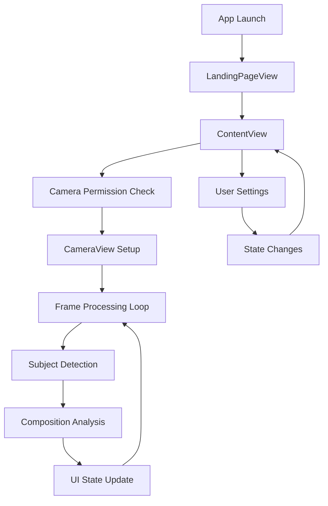

# Klick - Developer Guide

## 🚀 Quick Start

### Prerequisites
- Xcode 15.0+
- iOS 16.0+ deployment target
- iPhone 12+ for testing (camera-dependent features)

### Setup
1. Clone repository: `git clone <repository-url>`
2. Open `Klick.xcodeproj` in Xcode
3. Select target device (iPhone 12+ recommended)
4. Build and run (`Cmd+R`)
5. Grant camera permissions when prompted

---

## 📁 Project Structure

### File Organization
```
Klick/
├── KlickApp.swift                    # App entry point
├── Views/
│   ├── LandingPageView.swift         # Onboarding experience
│   ├── ContentView.swift             # Main camera interface
│   ├── CameraView.swift              # Camera implementation
│   ├── EducationalContentView.swift  # Learning modals
│   ├── FrameSettingsView.swift       # Settings panel
│   └── Overlay Views/
│       ├── CompositionOverlayView.swift
│       ├── FaceHighlightOverlayView.swift
│       └── GridOverlayView.swift
├── Composition System/
│   ├── CompositionManager.swift      # Central coordinator
│   ├── CompositionService.swift      # Service protocol + implementations
│   ├── CompositionPickerView.swift   # Type selection UI
│   └── CompositionIndicatorView.swift
└── Assets.xcassets/                  # Images and colors
```

### Key Architecture Files
- **`KlickApp.swift`**: App lifecycle and initial view
- **`ContentView.swift`**: Main view controller and state management
- **`CameraView.swift`**: Camera session and Vision processing
- **`CompositionManager.swift`**: Composition analysis coordination
- **`CompositionService.swift`**: Modular composition techniques

---

## 🏗️ Architecture Patterns

### 1. MVVM + Service Layer
```swift
// View (SwiftUI)
struct ContentView: View {
    @StateObject private var compositionManager = CompositionManager()  // ViewModel
    @State private var hasCameraPermission = false                      // Local State
}

// ViewModel (ObservableObject)
class CompositionManager: ObservableObject {
    @Published var currentCompositionType: CompositionType = .ruleOfThirds
    private let ruleOfThirdsService = RuleOfThirdsService()             // Service
}

// Service (Business Logic)
class RuleOfThirdsService: CompositionService {
    func evaluate(observation:, frameSize:, pixelBuffer:) -> CompositionResult
}
```

### 2. Protocol-Oriented Design
```swift
// Define capabilities through protocols
protocol CompositionService {
    var name: String { get }
    func evaluate(...) -> CompositionResult
}

// Multiple implementations
class RuleOfThirdsService: CompositionService { }
class CenterFramingService: CompositionService { }
```

### 3. SwiftUI + UIKit Bridge
```swift
// Bridge pattern for camera integration
struct CameraView: UIViewRepresentable {
    func makeUIView(context: Context) -> UIView {
        // Create UIKit camera view
    }
    
    func updateUIView(_ uiView: UIView, context: Context) {
        // Update from SwiftUI state changes
    }
}
```

---

## 🔧 Key Classes & Responsibilities

### ContentView
**Purpose**: Main view controller and application state management
**Responsibilities**:
- Camera permission handling
- UI state coordination (loading, feedback, modals)
- Integration between camera, composition, and UI components

**Key State Variables**:
```swift
@State private var hasCameraPermission = false
@State private var cameraLoading = true
@State private var feedbackMessage: String?
@StateObject private var compositionManager = CompositionManager()
```

### CameraView (UIViewRepresentable)
**Purpose**: Camera session management and frame processing
**Responsibilities**:
- AVCaptureSession setup and lifecycle
- Real-time frame processing with Vision framework
- Subject detection (faces, humans)
- Coordinate space conversion (Vision → Screen)

**Key Methods**:
```swift
private func setupCameraSession(for view: UIView, context: Context)
private func performSubjectDetection(pixelBuffer: CVPixelBuffer)
private func evaluateComposition(observation: VNDetectedObjectObservation, ...)
```

### CompositionManager (ObservableObject)
**Purpose**: Central coordinator for composition analysis
**Responsibilities**:
- Service lifecycle management
- Composition type switching
- Result caching and distribution
- Overlay generation coordination

**Public API**:
```swift
func evaluate(observation:, frameSize:, pixelBuffer:) -> CompositionResult
func switchToCompositionType(_ type: CompositionType)
func getBasicOverlays(frameSize: CGSize) -> [OverlayElement]
```

### CompositionService Protocol
**Purpose**: Pluggable composition analysis techniques
**Implementations**:
- `RuleOfThirdsService`: Grid-based analysis
- `CenterFramingService`: Center alignment with symmetry detection

**Protocol Definition**:
```swift
protocol CompositionService {
    var name: String { get }
    func evaluate(observation: VNDetectedObjectObservation, 
                 frameSize: CGSize, 
                 pixelBuffer: CVPixelBuffer?) -> CompositionResult
}
```

---

## 🔄 Data Flow & State Management

### Application State Flow


### Real-Time Processing Pipeline
```swift
// 1. Camera Frame Available
func captureOutput(_ output: AVCaptureOutput, didOutput sampleBuffer: CMSampleBuffer, ...)

// 2. Frame Throttling & Processing
guard frameCount % 3 == 0 else { return }
guard let pixelBuffer = CMSampleBufferGetImageBuffer(sampleBuffer) else { return }

// 3. Subject Detection (Background Queue)
DispatchQueue.global(qos: .userInitiated).async {
    let faceRequest = VNDetectFaceRectanglesRequest { request, error in
        // 4. Composition Analysis
        self.evaluateComposition(observation: face, pixelBuffer: pixelBuffer)
    }
}

// 5. UI Update (Main Queue)
DispatchQueue.main.async {
    self.parent.feedbackMessage = result.feedbackMessage
    self.parent.showFeedback = true
}
```

---

## 🎨 UI Patterns & Conventions

### SwiftUI State Binding Patterns
```swift
// Parent-child state sharing
struct ParentView: View {
    @State private var isEnabled = true
    
    var body: some View {
        ChildView(isEnabled: $isEnabled)  // Pass binding
    }
}

struct ChildView: View {
    @Binding var isEnabled: Bool  // Receive binding
}
```

### Animation Conventions
```swift
// Standard animation duration
.animation(.easeInOut(duration: 0.3), value: stateVariable)

// Spring animations for feedback
.animation(.spring, value: showFeedback)

// Staggered animations
DispatchQueue.main.asyncAfter(deadline: .now() + 0.3) {
    withAnimation(.easeOut(duration: 0.8)) {
        showNextElement = true
    }
}
```

### Modal Presentation Patterns
```swift
.sheet(isPresented: $showModal) {
    ModalView(isPresented: $showModal)
        .presentationDetents([.medium])  // Half-screen modal
}
```

---

## 🔍 Vision Framework Integration

### Subject Detection Setup
```swift
// Face detection configuration
let faceRequest = VNDetectFaceRectanglesRequest { request, error in
    // Handle results
}
faceRequest.revision = VNDetectFaceRectanglesRequestRevision3

// Human detection fallback
let humanRequest = VNDetectHumanRectanglesRequest { request, error in
    // Handle results
}
humanRequest.revision = VNDetectHumanRectanglesRequestRevision2

// Execute requests
let handler = VNImageRequestHandler(cvPixelBuffer: pixelBuffer, options: [:])
try? handler.perform([faceRequest])
```

### Coordinate Space Conversion
```swift
// Vision coordinates (0,0 bottom-left) → Screen coordinates (0,0 top-left)
private func convertVisionToScreenCoordinates(
    visionRect: CGRect, 
    pixelBuffer: CVPixelBuffer
) -> CGRect {
    let imageSize = CGSize(
        width: CVPixelBufferGetWidth(pixelBuffer),
        height: CVPixelBufferGetHeight(pixelBuffer)
    )
    
    // Convert and flip Y coordinate
    let convertedRect = VNImageRectForNormalizedRect(visionRect, imageSize.width, imageSize.height)
    let flippedRect = CGRect(
        x: convertedRect.origin.x,
        y: imageSize.height - convertedRect.origin.y - convertedRect.height,
        width: convertedRect.width,
        height: convertedRect.height
    )
    
    // Scale to view coordinates
    return scaleToViewCoordinates(flippedRect, imageSize: imageSize)
}
```

---

## ⚡ Performance Best Practices

### Frame Processing Optimization
```swift
// 1. Frame throttling
private var frameCount = 0
frameCount += 1
guard frameCount % 3 == 0 else { return }

// 2. Lazy initialization
guard cameraReady else { return }
guard currentTime - cameraStartTime > 1.0 else { return }

// 3. Background processing
DispatchQueue.global(qos: .userInitiated).async {
    // Heavy Vision processing
}

// 4. Main thread UI updates
DispatchQueue.main.async {
    // SwiftUI state updates
}
```

### Memory Management
```swift
// Weak references in closures
let faceRequest = VNDetectFaceRectanglesRequest { [weak self] request, error in
    guard let self = self else { return }
    // Process results
}

// Proper cleanup
deinit {
    session?.stopRunning()
    session = nil
}
```

---

## 🧪 Testing Patterns

### Testing Camera Features
```swift
// Test on physical device (camera required)
// Use iPhone 12+ for optimal performance
// Test different lighting conditions
// Verify face detection accuracy
```

### UI Testing Approach
```swift
// Test modal presentations
func testSettingsModal() {
    // Tap settings button
    // Verify modal appears
    // Test toggle interactions
    // Verify state changes
}

// Test composition switching
func testCompositionTypes() {
    // Open composition picker
    // Switch between types
    // Verify overlay changes
}
```

---

## 🚀 Adding New Features

### Adding a New Composition Service
1. **Implement Protocol**:
```swift
class GoldenRatioService: CompositionService {
    let name = "Golden Ratio"
    
    func evaluate(observation: VNDetectedObjectObservation, 
                 frameSize: CGSize, 
                 pixelBuffer: CVPixelBuffer?) -> CompositionResult {
        // Implement golden ratio analysis
        return CompositionResult(...)
    }
}
```

2. **Register Service**:
```swift
// In CompositionManager
private let goldenRatioService = GoldenRatioService()

var availableServices: [CompositionService] {
    [ruleOfThirdsService, centerFramingService, goldenRatioService]
}
```

3. **Update UI**:
```swift
// Add to CompositionType enum
enum CompositionType: String, CaseIterable {
    case goldenRatio = "Golden Ratio"
    
    var icon: String {
        case .goldenRatio: return "fibonacci.spiral"
    }
}
```

### Adding New UI Components
1. **Create SwiftUI View**
2. **Define State Requirements**
3. **Integrate with Parent Views**
4. **Add to Navigation Flow**

---

## 🔧 Common Development Tasks

### Debugging Camera Issues
```swift
// Add logging to camera setup
print("📷 Camera session setup started")
print("✅ Camera input configured")
print("🚀 Starting camera session...")

// Check session state
if session.isRunning {
    print("✅ Camera session is running")
} else {
    print("❌ Camera session failed to start")
}
```

### Modifying Composition Logic
```swift
// Adjust tolerance values
private let intersectionTolerance: Double = 0.12  // Increase for easier alignment

// Add new feedback messages
if score > 0.9 {
    feedbackMessage = "✅ Perfect alignment!"
} else if score > 0.7 {
    feedbackMessage = "✅ Great composition!"
}
```

### Performance Profiling
- Use Xcode Instruments for memory profiling
- Monitor frame rate during processing
- Check CPU usage during Vision requests
- Profile on target devices (iPhone 12+)

---

## 📚 Learning Resources

### Apple Documentation
- [Vision Framework](https://developer.apple.com/documentation/vision)
- [AVFoundation](https://developer.apple.com/documentation/avfoundation)
- [SwiftUI](https://developer.apple.com/documentation/swiftui)

### Project-Specific Knowledge
- Review existing composition services for patterns
- Study coordinate conversion logic carefully
- Understand frame throttling rationale
- Learn from performance optimization documentation

---

## 🤝 Contributing Guidelines

### Code Style
- Use clear, descriptive variable names
- Add comments for complex algorithms
- Follow SwiftUI naming conventions
- Use `// MARK:` for code organization

### Performance Considerations
- Always test on physical devices
- Profile before and after changes
- Consider memory impact of new features
- Maintain smooth camera preview

### Documentation
- Update feature references for new capabilities
- Document breaking changes
- Add code comments for complex logic
- Update architecture diagrams if needed

---

**Last Updated**: January 2025  
**Version**: 1.0 MVP  
**Target Platform**: iOS 16.0+, iPhone 12+ 