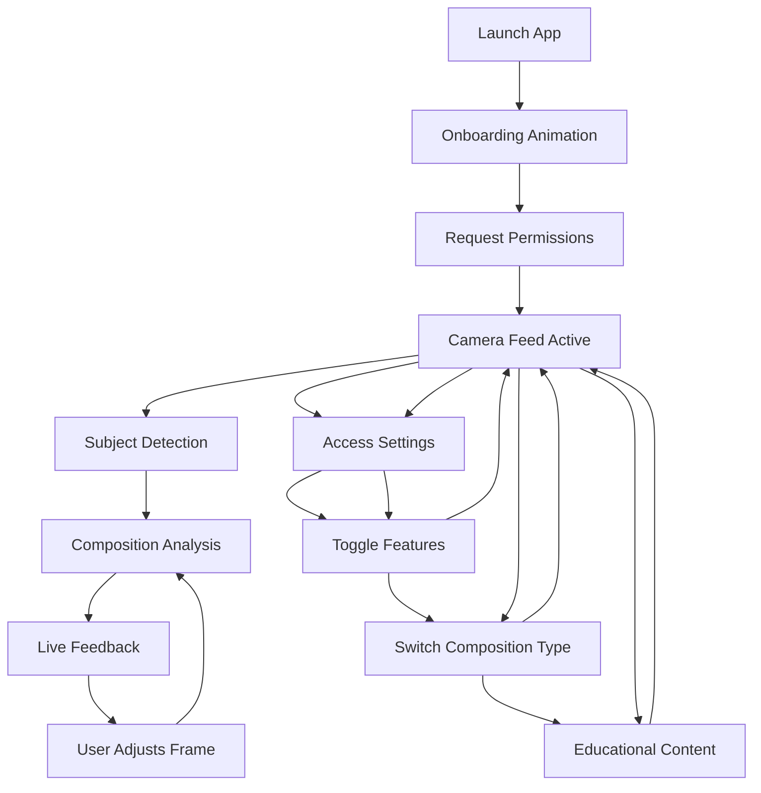

# Klick - Product Overview & Architecture

## 🎯 Product Vision

**Klick** is a real-time camera assistant that transforms how beginner and intermediate photographers learn composition techniques. By providing live, intelligent feedback during photo capture, Klick makes photography education interactive and immediate.

### Core Mission
- **Teach through interaction**: Learn composition by doing, not just reading
- **Real-time guidance**: Instant feedback while framing shots
- **Accessibility**: Make professional composition techniques accessible to everyone

## 🏗️ Architecture Overview

### Technical Stack
- **Framework**: SwiftUI + UIKit (UIViewRepresentable for camera)
- **Computer Vision**: Apple Vision framework (VNDetectFaceRectanglesRequest, VNDetectHumanRectanglesRequest)
- **Camera**: AVFoundation (AVCaptureSession, AVCapturePhotoOutput, AVCaptureVideoDataOutput)
- **Storage**: FileManager (local storage), Photos framework (photo library integration)
- **Image Processing**: Core Image, Accelerate framework
- **Platform**: iOS 16.0+, iPhone 12+

### Core Architecture Pattern: MVVM + Service Layer

```
┌─────────────────┐    ┌──────────────────┐    ┌─────────────────┐
│   SwiftUI Views │ ←→ │ ObservableObject │ ←→ │ Service Layer   │
│                 │    │ (ViewModels)     │    │                 │
│ • ContentView   │    │ • CompositionMgr │    │ • CameraView    │
│ • LandingPage   │    │                  │    │ • Composition   │
│ • SettingsView  │    │                  │    │   Services      │
└─────────────────┘    └──────────────────┘    └─────────────────┘
```

## 🎨 User Experience Design

### Design Principles
1. **Minimal Distraction**: Clean interface that doesn't interfere with photography
2. **Immediate Feedback**: Real-time visual and textual guidance
3. **Progressive Learning**: Educational content that builds understanding
4. **Accessibility**: Large touch targets (60x60pt minimum), high contrast overlays

### User Journey Flow


## 🧠 Core Concepts & Implementation

### 1. Real-Time Composition Analysis

**Concept**: Analyze camera frames in real-time to provide composition feedback without blocking the UI.

**Implementation Reference**: 
- [`CameraView.swift:275-305`](Klick/CameraView.swift) - `evaluateComposition()` method
- [`CompositionManager.swift:41-60`](Klick/CompositionManager.swift) - Main evaluation logic

**Key Features**:
- Frame throttling (every 3rd frame) for performance
- Background processing queue
- Lazy initialization (waits 1 second after camera start)

### 2. Modular Composition Services

**Concept**: Plugin-style architecture where different composition techniques can be easily added or swapped.

**Implementation Reference**:
- [`CompositionService.swift:1-20`](Klick/CompositionService.swift) - Protocol definition
- [`CompositionService.swift:66-394`](Klick/CompositionService.swift) - Service implementations

**Available Services**:
- **Rule of Thirds**: Grid overlay with intersection point analysis
- **Center Framing**: Crosshair overlay with symmetry detection
- **Symmetry**: Advanced pixel-level symmetry analysis

### 3. Intelligent Subject Detection

**Concept**: Multi-tier subject detection that prioritizes faces over general human detection.

**Implementation Reference**:
- [`CameraView.swift:154-220`](Klick/CameraView.swift) - Detection pipeline

**Detection Hierarchy**:
1. **Face Detection** (VNDetectFaceRectanglesRequest) - Primary
2. **Human Detection** (VNDetectHumanRectanglesRequest) - Fallback
3. **No Subject** - Show basic overlays only

### 4. Adaptive Visual Overlays

**Concept**: Dynamic overlay system that adapts based on composition type and detected subjects.

**Implementation Reference**:
- [`CompositionOverlayView.swift:1-27`](Klick/CompositionOverlayView.swift) - Overlay rendering
- [`CompositionService.swift:47-64`](Klick/CompositionService.swift) - OverlayElement structure

**Overlay Types**:
- **Grid**: Rule of thirds lines
- **Center Crosshair**: Center framing guide
- **Symmetry Line**: Vertical symmetry indicator
- **Guide Lines**: Dynamic composition guides

### 5. Comprehensive Photo Management

**Concept**: Complete photo lifecycle management from capture to storage to viewing and deletion.

**Implementation Reference**:
- [`PhotoManager.swift`](Klick/PhotoManager.swift) - Storage and file management
- [`PhotoAlbumView.swift`](Klick/PhotoAlbumView.swift) - Gallery interface
- [`CameraView.swift:345-436`](Klick/CameraView.swift) - Photo capture pipeline

**Key Features**:
- High-quality HEVC/JPEG photo capture with flash support
- Local storage with automatic photo library integration
- Responsive gallery with three interaction states
- Individual and batch photo deletion with safety confirmations

### 6. Progressive Performance Optimization

**Concept**: Multi-layered performance optimization that maintains quality while ensuring smooth real-time operation.

**Implementation Reference**:
- [`PERFORMANCE_OPTIMIZATIONS.md`](PERFORMANCE_OPTIMIZATIONS.md) - Detailed optimization strategies

**Key Optimizations**:
- Concurrent background processing (90%+ speed improvement)
- Frame throttling and lazy processing
- Image caching system
- Vectorized operations with Accelerate framework

## 📱 App Flow & State Management

### Application Lifecycle
1. **Launch** → `LandingPageView` with animated onboarding
2. **Transition** → Circular reveal animation to camera
3. **Camera Active** → Real-time composition analysis
4. **Settings** → Feature toggles and preferences
5. **Education** → Modal content explaining techniques

### State Management Architecture

```swift
// Main App State (ContentView)
@StateObject private var compositionManager = CompositionManager()
@State private var hasCameraPermission = false
@State private var cameraLoading = true

// Composition State (CompositionManager)
@Published var currentCompositionType: CompositionType = .ruleOfThirds
@Published var isEnabled = true
@Published var lastResult: CompositionResult?

// Camera State (CameraView.Coordinator)
var cameraReady = false
var frameCount = 0
var cameraStartTime = CACurrentMediaTime()
```

## 🔧 Key Technical Decisions

### 1. SwiftUI + UIViewRepresentable Hybrid
**Why**: SwiftUI for modern UI, UIViewRepresentable for mature camera APIs
**Benefit**: Best of both worlds - modern UI with reliable camera functionality

### 2. Vision Framework Over Core ML
**Why**: Built-in optimizations, no model management, consistent performance
**Benefit**: Reliable face/human detection without custom model training

### 3. Real-time Processing with Throttling
**Why**: Balance between responsiveness and performance
**Benefit**: Smooth UI with meaningful feedback frequency

### 4. Service-Based Architecture
**Why**: Extensibility and maintainability
**Benefit**: Easy to add new composition techniques without core changes

## 🎯 Success Metrics & Goals

### User Experience Goals
- **Learning Effectiveness**: Users improve composition skills through practice
- **Photo Quality**: High-quality captures with professional camera settings
- **Workflow Efficiency**: Seamless capture-to-gallery workflow
- **Accessibility**: Intuitive interface for photographers of all levels

### Technical Performance Goals
- **Frame Rate**: Maintain 30fps camera preview
- **Analysis Speed**: Composition feedback within 100ms
- **Capture Quality**: HEVC/JPEG with quality prioritization
- **Storage Efficiency**: 90% JPEG compression with UUID organization
- **Memory Usage**: < 100MB peak memory consumption
- **Battery Impact**: Minimal impact on device battery life

## 🚀 Future Extensibility

### Planned Architecture Enhancements
1. **Plugin System**: External composition rule plugins
2. **Cloud Learning**: Aggregate anonymized composition data
3. **Advanced ML**: Custom Core ML models for specialized detection
4. **Multi-Camera**: Support for different camera configurations

### Composition Techniques Roadmap
- **Golden Ratio**: Mathematical spiral overlays
- **Leading Lines**: Dynamic line detection and guidance
- **Depth of Field**: Focus plane analysis
- **Color Theory**: Complementary color guidance

---

**Last Updated**: January 2025  
**Version**: 1.0 MVP  
**Target Platform**: iOS 16.0+, iPhone 12+ 