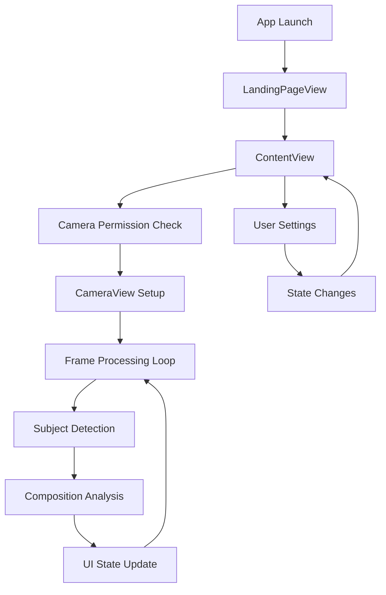

# Klick - Architecture Overview

**Last Updated**: October 30, 2025  
**Version**: 1.0 MVP  
**Target Platform**: iOS 16.0+

---

## 🎯 Architecture Philosophy

Klick employs a **hybrid SwiftUI/UIKit architecture** optimized for real-time computer vision processing while maintaining smooth UI performance. The architecture prioritizes:

1. **Real-Time Performance**: Non-blocking UI with background processing
2. **Modularity**: Plugin-style composition services
3. **Reactive State**: SwiftUI's declarative UI with automatic updates
4. **Extensibility**: Easy to add new features without core changes

---

## 🏗️ High-Level Architecture

```
┌─────────────────────────────────────────────────────────────┐
│                    Presentation Layer                       │
│  ┌─────────────┐  ┌─────────────┐  ┌─────────────┐         │
│  │   SwiftUI   │  │   Modals    │  │  Overlays   │         │
│  │    Views    │  │  Settings   │  │  Feedback   │         │
│  └─────────────┘  └─────────────┘  └─────────────┘         │
└─────────────────────────────────────────────────────────────┘
                              │
                              ▼
┌─────────────────────────────────────────────────────────────┐
│                  State Management Layer                     │
│  ┌─────────────┐  ┌─────────────┐  ┌─────────────┐         │
│  │ ContentView │  │Composition  │  │   Camera    │         │
│  │    State    │  │  Manager    │  │    State    │         │
│  └─────────────┘  └─────────────┘  └─────────────┘         │
└─────────────────────────────────────────────────────────────┘
                              │
                              ▼
┌─────────────────────────────────────────────────────────────┐
│                   Service Layer                             │
│  ┌─────────────┐  ┌─────────────┐  ┌─────────────┐         │
│  │Composition  │  │   Camera    │  │   Vision    │         │
│  │  Services   │  │   Service   │  │  Processing │         │
│  └─────────────┘  └─────────────┘  └─────────────┘         │
└─────────────────────────────────────────────────────────────┘
                              │
                              ▼
┌─────────────────────────────────────────────────────────────┐
│                   Platform Layer                            │
│  ┌─────────────┐  ┌─────────────┐  ┌─────────────┐         │
│  │AVFoundation │  │   Vision    │  │  Core Image │         │
│  │   Camera    │  │ Framework   │  │ Accelerate  │         │
│  └─────────────┘  └─────────────┘  └─────────────┘         │
└─────────────────────────────────────────────────────────────┘
```

---

## 🎨 MVVM + Service Layer Pattern

### Architecture Pattern

```
View (SwiftUI) ←→ ViewModel (ObservableObject) ←→ Service Layer
```

### Example Implementation

**View Layer (SwiftUI)**:
```swift
struct ContentView: View {
    @StateObject private var compositionManager = CompositionManager()
    @State private var hasCameraPermission = false
    
    var body: some View {
        CameraView(compositionManager: compositionManager)
    }
}
```

**ViewModel Layer (ObservableObject)**:
```swift
class CompositionManager: ObservableObject {
    @Published var currentCompositionType: CompositionType = .ruleOfThirds
    private let ruleOfThirdsService = RuleOfThirdsService()
    
    func evaluate(observation:, frameSize:, pixelBuffer:) -> CompositionResult {
        return currentService.evaluate(...)
    }
}
```

**Service Layer (Business Logic)**:
```swift
class RuleOfThirdsService: CompositionService {
    func evaluate(observation:, frameSize:, pixelBuffer:) -> CompositionResult {
        // Implement rule of thirds analysis
        return CompositionResult(...)
    }
}
```

---

## 🔄 Protocol-Oriented Design

### CompositionService Protocol

Klick uses protocol-oriented programming for composition analysis extensibility:

```swift
protocol CompositionService {
    var name: String { get }
    func evaluate(
        observation: VNDetectedObjectObservation,
        frameSize: CGSize,
        pixelBuffer: CVPixelBuffer?
    ) -> CompositionResult
}
```

**Benefits**:
- Easy to add new composition techniques
- Testable and mockable
- Clear interface contracts
- Dependency injection friendly

**Current Implementations**:
- `RuleOfThirdsService` - Grid-based analysis
- `CenterFramingService` - Center alignment with symmetry

**Location**: `Klick/CompositionService.swift`

---

## 🎬 SwiftUI + UIKit Bridge

### Camera Integration Pattern

```swift
struct CameraView: UIViewRepresentable {
    func makeUIView(context: Context) -> UIView {
        // Create UIKit camera view
        let view = UIView()
        context.coordinator.setupCamera(for: view)
        return view
    }
    
    func updateUIView(_ uiView: UIView, context: Context) {
        // Update from SwiftUI state changes
        context.coordinator.updateSettings()
    }
    
    func makeCoordinator() -> Coordinator {
        Coordinator(self)
    }
    
    class Coordinator: NSObject, AVCaptureVideoDataOutputSampleBufferDelegate {
        var parent: CameraView
        // Handle AVFoundation delegates
    }
}
```

**Why This Pattern**:
- SwiftUI provides modern reactive UI
- UIKit offers mature, stable camera APIs
- Coordinator pattern bridges delegate methods
- Best of both frameworks

**Location**: `Klick/Camera/Views/CameraView.swift`

---

## 📊 State Management Architecture

### State Hierarchy

```
ContentView (Root State)
├── Camera State
│   ├── hasCameraPermission: Bool
│   ├── cameraLoading: Bool
│   └── permissionStatus: AVAuthorizationStatus
├── Detection State
│   ├── detectedFaceBoundingBox: CGRect?
│   └── isFacialRecognitionEnabled: Bool
├── Composition State (CompositionManager)
│   ├── currentCompositionType: CompositionType
│   ├── isEnabled: Bool
│   └── lastResult: CompositionResult?
└── UI State
    ├── showFeedback: Bool
    ├── feedbackMessage: String?
    └── Various modal states
```

### SwiftUI State Management Patterns

**@State**: Local view state
```swift
@State private var showSettings = false
```

**@StateObject**: Observable object ownership
```swift
@StateObject private var compositionManager = CompositionManager()
```

**@Published**: Observable property changes
```swift
@Published var currentCompositionType: CompositionType
```

**@Binding**: Two-way data binding
```swift
@Binding var isEnabled: Bool
```

**See Also**: [STATE_MANAGEMENT.md](./STATE_MANAGEMENT.md) for detailed patterns

---

## 🔄 Real-Time Processing Pipeline

### Application State Flow



### Real-Time Processing Loop

```swift
// 1. Camera Frame Available (every frame @ 30fps)
func captureOutput(_ output: AVCaptureOutput, 
                  didOutput sampleBuffer: CMSampleBuffer, ...) {
    
    // 2. Frame Throttling (process every 3rd frame)
    guard frameCount % 3 == 0 else { return }
    guard let pixelBuffer = CMSampleBufferGetImageBuffer(sampleBuffer) else { return }
    
    // 3. Subject Detection (Background Queue)
    DispatchQueue.global(qos: .userInitiated).async {
        let faceRequest = VNDetectFaceRectanglesRequest { request, error in
            // 4. Composition Analysis
            self.evaluateComposition(observation: face, pixelBuffer: pixelBuffer)
        }
        
        // Execute Vision request
        try? VNImageRequestHandler(cvPixelBuffer: pixelBuffer).perform([faceRequest])
    }
    
    // 5. UI Update (Main Queue)
    DispatchQueue.main.async {
        self.parent.feedbackMessage = result.feedbackMessage
        self.parent.showFeedback = true
    }
}
```

**Performance Optimizations**:
- Frame throttling (every 3rd frame) for smooth performance
- Background processing to prevent UI blocking
- Lazy initialization (1-second delay after camera start)

**Location**: `Klick/Camera/Views/CameraView.swift:124-305`

---

## 🧠 Vision Framework Integration

### Subject Detection Pipeline

```
Frame Processing:
┌─────────────────┐
│ CVPixelBuffer   │ ← Camera frame
└────────┬────────┘
         │
         ├─ Primary Detection Path
         │
         ▼
┌─────────────────────────────┐
│ VNDetectFaceRectanglesRequest│
└────────┬────────────────────┘
         │ Success
         ├─────────────────────────────┐
         │ No faces found              │
         ▼                             ▼
┌────────────────────────┐    ┌─────────────────────────────┐
│ Face Detection Results │    │ VNDetectHumanRectanglesRequest│
└────────┬───────────────┘    └────────┬────────────────────┘
         │                             │
         └─────────────┬───────────────┘
                       ▼
         ┌─────────────────────────┐
         │ Composition Analysis    │
         └─────────────────────────┘
```

### Coordinate Space Conversion

**Challenge**: Vision uses normalized coordinates (0,0 = bottom-left), UIKit uses screen coordinates (0,0 = top-left)

```swift
private func convertVisionToScreenCoordinates(
    visionRect: CGRect, 
    pixelBuffer: CVPixelBuffer
) -> CGRect {
    let imageSize = CGSize(
        width: CVPixelBufferGetWidth(pixelBuffer),
        height: CVPixelBufferGetHeight(pixelBuffer)
    )
    
    // 1. Convert from normalized to pixel coordinates
    let convertedRect = VNImageRectForNormalizedRect(
        visionRect, 
        Int(imageSize.width), 
        Int(imageSize.height)
    )
    
    // 2. Flip Y coordinate (Vision → UIKit)
    let flippedRect = CGRect(
        x: convertedRect.origin.x,
        y: imageSize.height - convertedRect.origin.y - convertedRect.height,
        width: convertedRect.width,
        height: convertedRect.height
    )
    
    // 3. Scale to view coordinates
    return scaleToViewCoordinates(flippedRect, imageSize: imageSize)
}
```

**Location**: `Klick/Camera/Views/CameraView.swift:222-274`

---

## 🎯 Composition Analysis System

### Architecture

```
CompositionManager (Coordinator)
├── Service Registry
│   ├── RuleOfThirdsService
│   ├── CenterFramingService
│   └── (Future: GoldenRatioService, LeadingLinesService)
├── Current Service Selection
└── Public API
    ├── evaluate(observation:, frameSize:, pixelBuffer:)
    ├── switchToCompositionType(_ type:)
    ├── getBasicOverlays(frameSize:)
    └── getBestCompositionSuggestion(...)
```

### Service Implementation Pattern

```swift
class RuleOfThirdsService: CompositionService {
    let name = "Rule of Thirds"
    private let intersectionTolerance: Double = 0.12
    
    func evaluate(
        observation: VNDetectedObjectObservation, 
        frameSize: CGSize, 
        pixelBuffer: CVPixelBuffer?
    ) -> CompositionResult {
        // 1. Extract subject center
        let centerX = observation.boundingBox.midX
        let centerY = observation.boundingBox.midY
        
        // 2. Define intersection points
        let intersections = [
            (0.33, 0.33), (0.33, 0.67),
            (0.67, 0.33), (0.67, 0.67)
        ]
        
        // 3. Calculate distances
        let distances = intersections.map { intersection in
            sqrt(pow(centerX - intersection.0, 2) + pow(centerY - intersection.1, 2))
        }
        
        // 4. Determine alignment and score
        let minDistance = distances.min() ?? 1.0
        let isWellComposed = minDistance < intersectionTolerance
        let score = max(0, 1 - (minDistance / maxPossibleDistance))
        
        // 5. Generate feedback
        let feedbackMessage = generateFeedback(...)
        
        return CompositionResult(
            isWellComposed: isWellComposed,
            feedbackMessage: feedbackMessage,
            overlayElements: [createGridOverlay(frameSize)],
            score: score,
            compositionType: .ruleOfThirds
        )
    }
}
```

**Location**: `Klick/CompositionService.swift:268-394`

---

## 📸 Photo Management Architecture

### Complete Photo Lifecycle

```
Capture → Storage → Gallery → Edit → Export
   ↓         ↓         ↓        ↓       ↓
CameraView → PhotoManager → PhotoAlbum → ImagePreview → PHPhotoLibrary
```

### PhotoManager (Singleton Pattern)

```swift
class PhotoManager: ObservableObject {
    static let shared = PhotoManager()
    
    @Published var photos: [PhotoItem] = []
    private let photosDirectory: URL
    
    func savePhoto(_ image: UIImage) {
        // 1. Generate UUID filename
        let filename = "\(UUID().uuidString).jpg"
        let fileURL = photosDirectory.appendingPathComponent(filename)
        
        // 2. Compress and save to Documents
        if let jpegData = image.jpegData(compressionQuality: 0.9) {
            try? jpegData.write(to: fileURL)
            
            // 3. Update published array (triggers SwiftUI update)
            DispatchQueue.main.async {
                self.photos.insert(PhotoItem(url: fileURL, date: Date()), at: 0)
            }
            
            // 4. Save to Photo Library (optional)
            self.saveToPhotoLibrary(image)
        }
    }
}
```

**Storage Path**: `Documents/CapturedPhotos/[UUID].jpg`

**Location**: `Klick/PhotoManager.swift`

---

## 🎨 Filter & Effects System

### Dual Processing Architecture

```
Image Editing:
ImagePreviewView
├── FilterManager (LUT Filters)
│   ├── 42 .CUBE LUT files
│   ├── Core Image CIColorCube filter
│   └── GPU-accelerated rendering
└── BackgroundBlurManager (Blur Effects)
    ├── Vision person segmentation
    ├── Core Image gaussian blur
    └── Dual-method mask blending
```

### BackgroundBlurManager Architecture

```swift
class BackgroundBlurManager {
    static let shared = BackgroundBlurManager()
    
    // Metal-accelerated context
    private let context: CIContext = {
        if let metalDevice = MTLCreateSystemDefaultDevice() {
            return CIContext(mtlDevice: metalDevice, options: [
                .cacheIntermediates: true,
                .useSoftwareRenderer: false
            ])
        }
        return CIContext()
    }()
    
    // Session-based caching
    private let maskCache = NSCache<NSString, CIImage>()
    private let blurCache = NSCache<NSString, UIImage>()
    
    func applyBackgroundBlur(
        to image: UIImage,
        blurIntensity: Float,
        useCache: Bool
    ) -> UIImage? {
        // 1. Generate person segmentation mask
        // 2. Apply gaussian blur to background
        // 3. Blend using mask (sharp subject, blurred background)
        // 4. Cache results for performance
    }
}
```

**Location**: `Klick/BackgroundBlurManager.swift`

---

## ⚡ Performance Architecture

### Threading Model

```
Thread Hierarchy:
├── Main Thread
│   ├── SwiftUI state updates
│   ├── UI rendering and animations
│   └── User interaction handling
├── Background Thread (Global .userInitiated)
│   ├── Camera session setup
│   ├── Frame processing pipeline
│   └── Vision framework requests
└── Background Thread (Global .background)
    ├── Camera session lifecycle
    ├── Heavy image processing
    └── Concurrent analysis tasks
```

### Memory Management Strategy

```swift
// Weak reference patterns to prevent retain cycles
class CameraView: UIViewRepresentable {
    class Coordinator: NSObject {
        var parent: CameraView  // Strong reference OK (owned by view)
        
        func captureOutput(...) {
            // Weak self in async closures
            let faceRequest = VNDetectFaceRectanglesRequest { [weak self] request, error in
                guard let self = self else { return }
                // Process without retain cycles
            }
        }
    }
}

// Proper cleanup
deinit {
    session?.stopRunning()
    session = nil
    previewLayer?.removeFromSuperlayer()
    previewLayer = nil
}
```

### Performance Optimizations Summary

| Optimization | Improvement | Implementation |
|--------------|-------------|----------------|
| Frame Throttling | Smooth 30fps UI | Process every 3rd frame |
| Concurrent Processing | 90%+ faster | async/await task groups |
| Smart Caching | 60% memory reduction | Session-based NSCache |
| Metal Acceleration | 3-5x faster rendering | Metal-backed CIContext |
| Preview Resolution | 10-16x faster | 400×600 vs full resolution |

**Detailed Docs**: [6_Performance/](../6_Performance/) directory

---

## 🧩 Extension Points

### Adding New Composition Service

```swift
// 1. Implement protocol
class GoldenRatioService: CompositionService {
    let name = "Golden Ratio"
    
    func evaluate(...) -> CompositionResult {
        // Golden ratio spiral analysis
        return CompositionResult(...)
    }
}

// 2. Register in CompositionManager
class CompositionManager {
    private let goldenRatioService = GoldenRatioService()
    
    var availableServices: [CompositionService] {
        [ruleOfThirdsService, centerFramingService, goldenRatioService]
    }
}

// 3. Update CompositionType enum
enum CompositionType: String, CaseIterable {
    case goldenRatio = "Golden Ratio"
    
    var icon: String {
        case .goldenRatio: return "fibonacci.spiral"
    }
}
```

### Adding New Filter

```swift
// 1. Add .CUBE file to Klick/Luts/
// 2. Add to FilterManager filter list
// 3. UI automatically updates (array-driven)
```

---

## 🔮 Future Architecture Enhancements

### Planned Scalability Improvements

**Core ML Integration**:
```swift
class CustomCompositionModel {
    private let model: MLModel
    
    func analyzeComposition(pixelBuffer: CVPixelBuffer) async -> CompositionPrediction {
        let prediction = try await model.prediction(from: pixelBuffer)
        return CompositionPrediction(prediction)
    }
}
```

**Plugin Architecture**:
```swift
protocol CompositionPlugin {
    var identifier: String { get }
    var version: String { get }
    var service: CompositionService { get }
}

class PluginManager {
    func loadPlugin(from bundle: Bundle) throws {
        // Dynamic plugin loading
    }
}
```

---

## 📋 Architecture Decision Records

### ADR-001: SwiftUI + UIKit Hybrid
**Decision**: Use SwiftUI for UI with UIViewRepresentable for camera  
**Rationale**: SwiftUI provides modern reactive UI, UIKit offers mature camera APIs  
**Trade-offs**: Slight complexity in bridging, but optimal performance and maintainability

### ADR-002: Protocol-Oriented Composition Services
**Decision**: Use protocol-based architecture for composition techniques  
**Rationale**: Enables easy extension and testing of new composition rules  
**Trade-offs**: Slight overhead vs. direct implementation, but much better extensibility

### ADR-003: Frame Throttling Strategy
**Decision**: Process every 3rd frame with 1-second warm-up delay  
**Rationale**: Balances responsiveness with performance and battery life  
**Trade-offs**: Slight delay in feedback vs. smooth performance

### ADR-004: Vision Framework Over Core ML
**Decision**: Use Apple's Vision framework for subject detection  
**Rationale**: Optimized performance, no model management, consistent results  
**Trade-offs**: Less customization vs. reliability and performance

**See Also**: [DECISION_RECORDS.md](../8_Reference/DECISION_RECORDS.md)

---

## 📚 Related Documentation

- **[COMPONENT_MAP.md](./COMPONENT_MAP.md)** - Visual component relationships
- **[STATE_MANAGEMENT.md](./STATE_MANAGEMENT.md)** - State management patterns
- **[DATA_FLOW.md](./DATA_FLOW.md)** - Complete data flow diagrams
- **[TECH_STACK.md](../TECH_STACK.md)** - Technologies and frameworks
- **[DEVELOPER_GUIDE.md](../4_Development/DEVELOPER_GUIDE.md)** - Development workflow

---

**Document Status**: ✅ Complete  
**Last Verified**: October 30, 2025  
**Maintained By**: Tech Lead  
**Review Cycle**: Per major release

