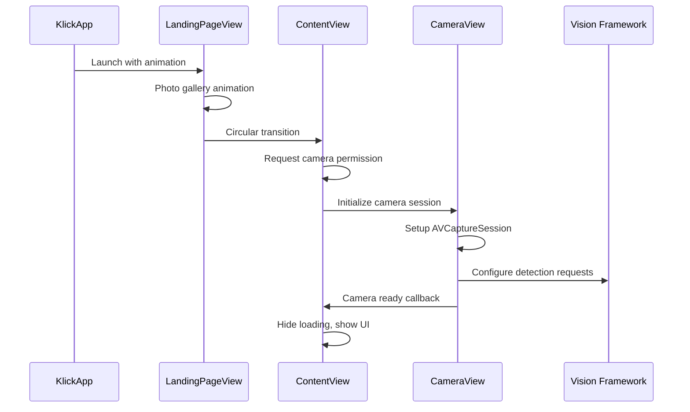
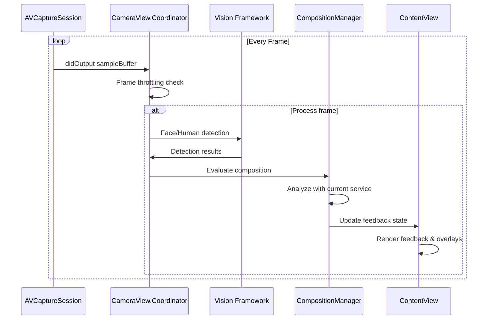

# Klick - Technical Architecture

## 🏗️ System Architecture Overview

Klick employs a hybrid SwiftUI/UIKit architecture optimized for real-time computer vision processing while maintaining smooth UI performance.

### High-Level Architecture
```
┌─────────────────────────────────────────────────────────────┐
│                    Presentation Layer                       │
│  ┌─────────────┐  ┌─────────────┐  ┌─────────────┐         │
│  │   SwiftUI   │  │   Modals    │  │  Overlays   │         │
│  │    Views    │  │  Settings   │  │  Feedback   │         │
│  └─────────────┘  └─────────────┘  └─────────────┘         │
└─────────────────────────────────────────────────────────────┘
                              │
                              ▼
┌─────────────────────────────────────────────────────────────┐
│                  State Management Layer                     │
│  ┌─────────────┐  ┌─────────────┐  ┌─────────────┐         │
│  │ ContentView │  │Composition  │  │   Camera    │         │
│  │    State    │  │  Manager    │  │    State    │         │
│  └─────────────┘  └─────────────┘  └─────────────┘         │
└─────────────────────────────────────────────────────────────┘
                              │
                              ▼
┌─────────────────────────────────────────────────────────────┐
│                   Service Layer                             │
│  ┌─────────────┐  ┌─────────────┐  ┌─────────────┐         │
│  │Composition  │  │   Camera    │  │   Vision    │         │
│  │  Services   │  │   Service   │  │  Processing │         │
│  └─────────────┘  └─────────────┘  └─────────────┘         │
└─────────────────────────────────────────────────────────────┘
                              │
                              ▼
┌─────────────────────────────────────────────────────────────┐
│                   Platform Layer                            │
│  ┌─────────────┐  ┌─────────────┐  ┌─────────────┐         │
│  │AVFoundation │  │   Vision    │  │  Core Image │         │
│  │   Camera    │  │ Framework   │  │ Accelerate  │         │
│  └─────────────┘  └─────────────┘  └─────────────┘         │
└─────────────────────────────────────────────────────────────┘
```

## 🎯 Core Design Principles

### 1. Real-Time Performance First
- **Non-blocking UI**: All heavy processing on background queues
- **Frame throttling**: Process every 3rd frame to maintain 30fps
- **Lazy initialization**: Delay processing until camera is stable

### 2. Modular Composition System
- **Protocol-oriented**: `CompositionService` protocol enables pluggable techniques
- **Service isolation**: Each composition technique is self-contained
- **Easy extension**: New techniques require minimal core changes

### 3. Reactive State Management
- **SwiftUI @Published**: Automatic UI updates on state changes
- **Single source of truth**: Centralized state in observable objects
- **Predictable updates**: Clear data flow from services to UI

### 4. Hybrid UI Architecture
- **SwiftUI primary**: Modern declarative UI for most components
- **UIKit bridge**: Camera integration via `UIViewRepresentable`
- **Seamless integration**: Native feel across both paradigms

---

## 📱 Application Lifecycle

### Startup Sequence


### Real-Time Processing Loop


---

## 🎥 Camera System Architecture

### AVFoundation Integration
```swift
// Camera session hierarchy
AVCaptureSession
├── AVCaptureDeviceInput (rear camera)
├── AVCaptureVideoDataOutput (frame processing)
└── AVCaptureVideoPreviewLayer (UI display)

// Threading model
Main Thread: UI updates, session control
Background Thread: Session setup, frame processing
Global Queue: Vision framework processing
```

### Camera Session Configuration
```swift
class CameraView: UIViewRepresentable {
    // MARK: - Session Setup
    private func setupCameraSession(for view: UIView, context: Context) {
        // 1. Create session with photo preset
        let session = AVCaptureSession()
        session.sessionPreset = .photo
        
        // 2. Configure input (rear camera)
        guard let camera = AVCaptureDevice.default(.builtInWideAngleCamera, 
                                                  for: .video, 
                                                  position: .back),
              let input = try? AVCaptureDeviceInput(device: camera) else {
            return
        }
        session.addInput(input)
        
        // 3. Configure output (frame processing)
        let videoOutput = AVCaptureVideoDataOutput()
        videoOutput.setSampleBufferDelegate(context.coordinator, 
                                           queue: DispatchQueue.global(qos: .userInitiated))
        session.addOutput(videoOutput)
        
        // 4. Configure preview layer
        let previewLayer = AVCaptureVideoPreviewLayer(session: session)
        previewLayer.videoGravity = .resizeAspectFill
        previewLayer.frame = view.bounds
        view.layer.addSublayer(previewLayer)
        
        // 5. Start session on background thread
        DispatchQueue.global(qos: .background).async {
            session.startRunning()
        }
    }
}
```

### Frame Processing Pipeline
```swift
// Performance-optimized processing
func captureOutput(_ output: AVCaptureOutput, 
                  didOutput sampleBuffer: CMSampleBuffer, 
                  from connection: AVCaptureConnection) {
    
    // 1. Stability check
    guard cameraReady else { return }
    guard currentTime - cameraStartTime > 1.0 else { return }
    
    // 2. Frame throttling
    frameCount += 1
    guard frameCount % 3 == 0 else { return }
    
    // 3. Extract pixel buffer
    guard let pixelBuffer = CMSampleBufferGetImageBuffer(sampleBuffer) else { return }
    
    // 4. Background processing
    if parent.isFacialRecognitionEnabled {
        performSubjectDetection(pixelBuffer: pixelBuffer)
    }
}
```

---

## 🧠 Vision Framework Integration

### Detection Pipeline Architecture
```swift
// Multi-tier detection strategy
Subject Detection Pipeline:
├── Primary: VNDetectFaceRectanglesRequest
│   ├── Revision: VNDetectFaceRectanglesRequestRevision3
│   ├── Accuracy: High precision for face detection
│   └── Fallback: Human detection if no faces found
└── Secondary: VNDetectHumanRectanglesRequest
    ├── Revision: VNDetectHumanRectanglesRequestRevision2
    ├── Use case: Full body detection
    └── Performance: Optimized for real-time processing
```

### Coordinate Space Management
```swift
// Complex coordinate conversion: Vision → Screen
private func convertVisionToScreenCoordinates(
    visionRect: CGRect, 
    pixelBuffer: CVPixelBuffer
) -> CGRect {
    
    // 1. Get image dimensions
    let imageSize = CGSize(
        width: CVPixelBufferGetWidth(pixelBuffer),
        height: CVPixelBufferGetHeight(pixelBuffer)
    )
    
    // 2. Convert normalized rect to image coordinates
    let convertedRect = VNImageRectForNormalizedRect(
        visionRect, 
        Int(imageSize.width), 
        Int(imageSize.height)
    )
    
    // 3. Flip Y coordinate (Vision: bottom-left, UIKit: top-left)
    let flippedRect = CGRect(
        x: convertedRect.origin.x,
        y: imageSize.height - convertedRect.origin.y - convertedRect.height,
        width: convertedRect.width,
        height: convertedRect.height
    )
    
    // 4. Scale to view coordinates with aspect ratio consideration
    return scaleToViewCoordinates(flippedRect, imageSize: imageSize)
}
```

### Performance Optimization Strategies
```swift
// Background processing with weak references
DispatchQueue.global(qos: .userInitiated).async { [weak self] in
    guard let self = self else { return }
    
    let faceRequest = VNDetectFaceRectanglesRequest { [weak self] request, error in
        guard let self = self else { return }
        
        DispatchQueue.main.async {
            // UI updates on main thread
            self.processDetectionResults(request.results)
        }
    }
    
    // Configure for optimal performance
    faceRequest.revision = VNDetectFaceRectanglesRequestRevision3
    
    let handler = VNImageRequestHandler(cvPixelBuffer: pixelBuffer, options: [:])
    try? handler.perform([faceRequest])
}
```

---

## 🎨 Composition Analysis System

### Service Architecture
```swift
// Protocol-oriented design for extensibility
protocol CompositionService {
    var name: String { get }
    func evaluate(observation: VNDetectedObjectObservation, 
                 frameSize: CGSize, 
                 pixelBuffer: CVPixelBuffer?) -> CompositionResult
}

// Service registry pattern
class CompositionManager: ObservableObject {
    // Service instances
    private let ruleOfThirdsService = RuleOfThirdsService()
    private let centerFramingService = CenterFramingService()
    
    // Dynamic service selection
    private var currentService: CompositionService {
        switch currentCompositionType {
        case .ruleOfThirds: return ruleOfThirdsService
        case .centerFraming: return centerFramingService
        case .symmetry: return centerFramingService
        }
    }
}
```

### Rule of Thirds Implementation
```swift
class RuleOfThirdsService: CompositionService {
    private let intersectionTolerance: Double = 0.12
    
    func evaluate(observation: VNDetectedObjectObservation, 
                 frameSize: CGSize, 
                 pixelBuffer: CVPixelBuffer?) -> CompositionResult {
        
        // 1. Extract subject center in normalized coordinates
        let centerX = observation.boundingBox.midX
        let centerY = observation.boundingBox.midY
        
        // 2. Define intersection points (rule of thirds)
        let intersections = [
            (0.33, 0.33), (0.33, 0.67),
            (0.67, 0.33), (0.67, 0.67)
        ]
        
        // 3. Calculate distances to all intersections
        let distances = intersections.map { intersection in
            let dx = centerX - intersection.0
            let dy = centerY - intersection.1
            return sqrt(dx * dx + dy * dy)
        }
        
        // 4. Determine alignment based on minimum distance
        let minDistance = distances.min() ?? 1.0
        let isWellComposed = minDistance < intersectionTolerance
        
        // 5. Calculate normalized score (0.0 to 1.0)
        let maxPossibleDistance = sqrt(0.5 * 0.5 + 0.5 * 0.5)
        let score = max(0, 1 - (minDistance / maxPossibleDistance))
        
        // 6. Generate contextual feedback
        let feedbackMessage = generateFeedback(
            isWellComposed: isWellComposed,
            score: score,
            nearestIntersection: intersections[distances.firstIndex(of: minDistance) ?? 0],
            currentPosition: (centerX, centerY)
        )
        
        return CompositionResult(
            isWellComposed: isWellComposed,
            feedbackMessage: feedbackMessage,
            overlayElements: [createGridOverlay(frameSize: frameSize)],
            score: score,
            compositionType: .ruleOfThirds
        )
    }
}
```

### Center Framing with Symmetry Analysis
```swift
class CenterFramingService: CompositionService {
    private let centerTolerance: Double = 0.15
    
    // Advanced pixel-level symmetry analysis
    private func calculateSymmetryScore(pixelBuffer: CVPixelBuffer) -> Double {
        // 1. Lock pixel buffer for reading
        CVPixelBufferLockBaseAddress(pixelBuffer, .readOnly)
        defer { CVPixelBufferUnlockBaseAddress(pixelBuffer, .readOnly) }
        
        guard let baseAddress = CVPixelBufferGetBaseAddress(pixelBuffer) else {
            return 0.0
        }
        
        // 2. Get buffer properties
        let width = CVPixelBufferGetWidth(pixelBuffer)
        let height = CVPixelBufferGetHeight(pixelBuffer)
        let bytesPerRow = CVPixelBufferGetBytesPerRow(pixelBuffer)
        let data = baseAddress.assumingMemoryBound(to: UInt8.self)
        
        var totalDifference: Double = 0
        var totalPixels = 0
        let midWidth = width / 2
        
        // 3. Compare left and right halves pixel by pixel
        for y in 0..<height {
            let rowStart = y * bytesPerRow
            
            for x in 0..<midWidth {
                let leftPixelIndex = rowStart + x * 4
                let rightPixelIndex = rowStart + (width - 1 - x) * 4
                
                // Compare RGB values (skip alpha channel)
                for channel in 0..<3 {
                    let leftValue = Double(data[leftPixelIndex + channel])
                    let rightValue = Double(data[rightPixelIndex + channel])
                    totalDifference += abs(leftValue - rightValue)
                }
                
                totalPixels += 3
            }
        }
        
        // 4. Calculate similarity score
        if totalPixels == 0 { return 0.0 }
        let avgDifference = totalDifference / Double(totalPixels)
        let maxDifference = 255.0
        return max(0.0, min(1.0, 1.0 - (avgDifference / maxDifference)))
    }
}
```

---

## 🎭 UI Architecture & State Management

### SwiftUI State Hierarchy
```swift
// Root state container
struct ContentView: View {
    // MARK: - Camera State
    @State private var hasCameraPermission = false
    @State private var cameraLoading = true
    @State private var permissionStatus: AVAuthorizationStatus = .notDetermined
    
    // MARK: - Detection State
    @State private var detectedFaceBoundingBox: CGRect?
    @State private var isFacialRecognitionEnabled = true
    
    // MARK: - Composition State
    @StateObject private var compositionManager = CompositionManager()
    
    // MARK: - UI State
    @State private var feedbackMessage: String?
    @State private var showFeedback = false
    @State private var showEducationalContent = false
    
    // MARK: - Modal State
    @State private var showCompositionPicker = false
    @State private var showFrameSettings = false
}
```

### Reactive Data Flow
```swift
// Observable composition manager
class CompositionManager: ObservableObject {
    @Published var currentCompositionType: CompositionType = .ruleOfThirds
    @Published var isEnabled = true
    @Published var lastResult: CompositionResult?
    
    // Automatic UI updates when published properties change
    func switchToCompositionType(_ type: CompositionType) {
        currentCompositionType = type  // Triggers UI update
        lastResult = nil
    }
}

// SwiftUI automatic updates
var body: some View {
    // UI automatically updates when compositionManager properties change
    CompositionIndicatorView(
        compositionManager: compositionManager,
        compositionType: compositionManager.currentCompositionType.rawValue
    )
}
```

### Animation System
```swift
// Coordinated animation patterns
struct ContentView: View {
    var body: some View {
        ZStack {
            // Feedback with spring animation
            if showFeedback, let message = feedbackMessage {
                Text(message)
                    .scaleEffect(showFeedback ? 1.0 : 0.01)
                    .opacity(showFeedback ? 1.0 : 0.0)
                    .animation(.spring, value: showFeedback)
            }
            
            // Overlay with smooth transitions
            if !areOverlaysHidden {
                CompositionOverlayView(...)
                    .transition(.opacity)
                    .animation(.easeInOut(duration: 0.3), value: compositionType)
            }
        }
    }
}
```

---

## 🚀 Performance Architecture

### Threading Model
```swift
// Clear separation of concerns across threads
Thread Responsibilities:
├── Main Thread
│   ├── SwiftUI state updates
│   ├── UI rendering and animations
│   └── User interaction handling
├── Background Thread (Global QoS: .userInitiated)
│   ├── Camera session setup
│   ├── Frame processing pipeline
│   └── Vision framework requests
└── Background Thread (Global QoS: .background)
    ├── Camera session lifecycle
    ├── Heavy image processing
    └── Concurrent analysis tasks
```

### Memory Management Strategy
```swift
// Weak reference patterns
class CameraView: UIViewRepresentable {
    class Coordinator: NSObject, AVCaptureVideoDataOutputSampleBufferDelegate {
        var parent: CameraView  // Strong reference to parent
        
        func captureOutput(...) {
            // Weak self in async closures
            let faceRequest = VNDetectFaceRectanglesRequest { [weak self] request, error in
                guard let self = self else { return }
                // Process without retain cycles
            }
        }
    }
}

// Proper cleanup
deinit {
    session?.stopRunning()
    session = nil
    previewLayer?.removeFromSuperlayer()
    previewLayer = nil
}
```

### Concurrent Processing Architecture
```swift
// Future enhancement: Concurrent image analysis
async let histogramTask = analyzeHistogramConcurrent(thumbnail)
async let angleTask = analyzeAngleConcurrent(thumbnail)
async let leadingLinesTask = analyzeLeadingLinesConcurrent(thumbnail)
async let saliencyTask = analyzeSaliencyConcurrent(thumbnail)

let (histogramData, angleAnalysis, leadingLinesAnalysis, salientRegions) = await (
    histogramTask,
    angleTask,
    leadingLinesTask,
    saliencyTask
)

// Performance improvement: 4-7 minutes → 15-30 seconds
```

---

## 🔧 Extension Points & Modularity

### Adding New Composition Services
```swift
// 1. Implement the protocol
class GoldenRatioService: CompositionService {
    let name = "Golden Ratio"
    
    func evaluate(observation: VNDetectedObjectObservation, 
                 frameSize: CGSize, 
                 pixelBuffer: CVPixelBuffer?) -> CompositionResult {
        // Golden ratio spiral analysis
        let spiralPoints = calculateGoldenSpiral(frameSize: frameSize)
        let subjectDistance = calculateDistanceToSpiral(
            subject: observation.boundingBox,
            spiral: spiralPoints
        )
        
        return CompositionResult(
            isWellComposed: subjectDistance < tolerance,
            feedbackMessage: generateSpiralFeedback(distance: subjectDistance),
            overlayElements: [createSpiralOverlay(frameSize: frameSize)],
            score: calculateSpiralScore(distance: subjectDistance),
            compositionType: .goldenRatio
        )
    }
}

// 2. Register in composition manager
class CompositionManager: ObservableObject {
    private let goldenRatioService = GoldenRatioService()
    
    var availableServices: [CompositionService] {
        [ruleOfThirdsService, centerFramingService, goldenRatioService]
    }
}

// 3. Update UI enums
enum CompositionType: String, CaseIterable {
    case goldenRatio = "Golden Ratio"
    
    var icon: String {
        case .goldenRatio: return "fibonacci.spiral"
    }
}
```

### Custom Overlay System
```swift
// Extensible overlay architecture
enum OverlayType {
    case grid
    case centerCrosshair
    case symmetryLine
    case guideLine
    case spiral        // New overlay type
    case leadingLines  // Future enhancement
}

struct OverlayElement {
    let type: OverlayType
    let path: Path
    let color: Color
    let opacity: Double
    let lineWidth: CGFloat
    let animationDuration: Double?  // Optional animation
}
```

---

## 📊 Metrics & Analytics Architecture

### Performance Monitoring
```swift
// Built-in performance tracking
struct PerformanceMetrics {
    var frameProcessingTime: TimeInterval
    var visionRequestDuration: TimeInterval
    var compositionAnalysisDuration: TimeInterval
    var uiUpdateLatency: TimeInterval
}

// Measurement points
let startTime = CACurrentMediaTime()
// ... processing ...
let endTime = CACurrentMediaTime()
let processingTime = endTime - startTime

print("📊 Vision processing completed in \(Int(processingTime * 1000))ms")
```

### Usage Analytics Framework
```swift
// Privacy-first analytics structure
struct UsageAnalytics {
    var compositionTypePreferences: [CompositionType: Int]
    var averageSessionDuration: TimeInterval
    var featureUsageStats: [String: Int]
    var performanceMetrics: PerformanceMetrics
    
    // No personally identifiable information collected
}
```

---

## 🔮 Future Architecture Enhancements

### Planned Scalability Improvements

#### 1. Core ML Integration
```swift
// Custom model pipeline
class CustomCompositionModel {
    private let model: MLModel
    
    func analyzeComposition(pixelBuffer: CVPixelBuffer) async -> CompositionPrediction {
        let input = try MLFeatureValue(pixelBuffer: pixelBuffer)
        let prediction = try await model.prediction(from: input)
        return CompositionPrediction(prediction)
    }
}
```

#### 2. Plugin Architecture
```swift
// External composition plugins
protocol CompositionPlugin {
    var identifier: String { get }
    var version: String { get }
    var service: CompositionService { get }
}

class PluginManager {
    private var loadedPlugins: [CompositionPlugin] = []
    
    func loadPlugin(from bundle: Bundle) throws {
        // Dynamic plugin loading
    }
}
```

#### 3. Cloud-Enhanced Learning
```swift
// Federated learning architecture
class CloudLearningService {
    func submitAnonymizedCompositionData(_ data: CompositionData) async {
        // Privacy-preserving data submission
    }
    
    func downloadImprovedModels() async -> [MLModel] {
        // Enhanced model distribution
    }
}
```

---

## 📋 Architecture Decision Records

### ADR-001: SwiftUI + UIKit Hybrid Approach
**Decision**: Use SwiftUI for UI with UIViewRepresentable for camera
**Rationale**: SwiftUI provides modern reactive UI, UIKit offers mature camera APIs
**Trade-offs**: Slight complexity in bridging, but optimal performance and maintainability

### ADR-002: Protocol-Oriented Composition Services
**Decision**: Use protocol-based architecture for composition techniques
**Rationale**: Enables easy extension and testing of new composition rules
**Trade-offs**: Slight overhead vs. direct implementation, but much better extensibility

### ADR-003: Frame Throttling Strategy
**Decision**: Process every 3rd frame with 1-second warm-up delay
**Rationale**: Balances responsiveness with performance and battery life
**Trade-offs**: Slight delay in feedback vs. smooth performance

### ADR-004: Vision Framework Over Core ML
**Decision**: Use Apple's Vision framework for subject detection
**Rationale**: Optimized performance, no model management, consistent results
**Trade-offs**: Less customization vs. reliability and performance

---

**Document Version**: 1.0  
**Last Updated**: January 2025  
**Architecture Version**: MVP 1.0  
**Target Platform**: iOS 16.0+ 